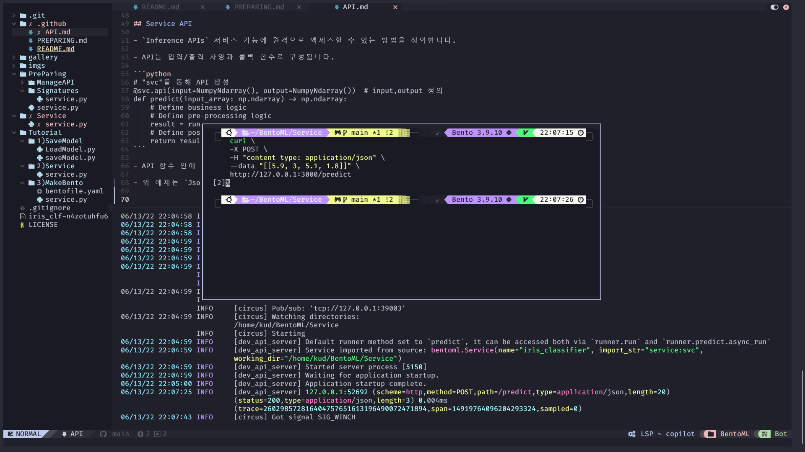
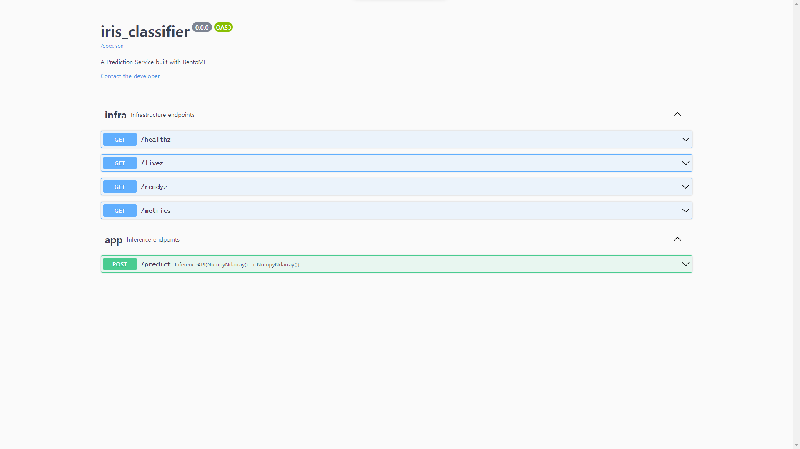
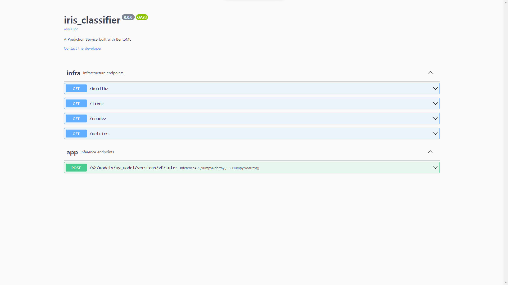

# Service and API

## 서비스 생성

- `BentoML`서비스는 `Runner`와 `API`로 구성됩니다.

```python
import numpy as np
import bentoml
from bentoml.io import NumpyNdarray

iris_clf_runner = bentoml.sklearn.get("iris_clf:latest").to_runner()

svc = bentoml.Service("iris_classifier", runners=[iris_clf_runner])

@svc.api(input=NumpyNdarray(), output=NumpyNdarray())
def classify(input_series: np.ndarray) -> np.ndarray:
    result = iris_clf_runner.predict.run(input_series)
    return result

```

- `bentoml serve service:svc --reload`를 통해 bentoml Service를 실행시킬수 있습니다 

```python
# Create the iris_classifier_service with the ScikitLearn runner
svc = bentoml.Service("iris_classifier", runners=[iris_clf_runner])
```
- 서비스는 `bentoml.Service` 호출을 서비스 이름과 `Runner` 통해 초기화됩니다.

```python
@svc.api(input=NumpyNdarray(), output=NumpyNdarray())
def classify(input_series: np.ndarray) -> np.ndarray:
    result = iris_clf_runner.predict.run(input_series)
    return result
```

- `svc`는 API를 지정하는 데코레이터 입니다.


## Runner

- 러너(`Runner`)는 처리량(`throughput`) 과 리소스 사용률(`resource utilization`)을 극대화할 수 있는 서비스 로직의 단위를 나타냅니다.

  - `runner = bentoml.sklearn.get("iris_clf:latest").to_runner()` 

- 모델에서 작성된 Runner는 대상 ML 프레임워크에 고유한 최적의 Runner 구성을 자동으로 선택합니다.

## Service API

- `Inference APIs` 서비스 기능에 원격으로 액세스할 수 있는 방법을 정의합니다.

- API는 입력/출력 사양과 콜백 함수로 구성됩니다.

```python
# "svc"를 통해 API 생성
@svc.api(input=NumpyNdarray(), output=NumpyNdarray())  # input,output 정의
def predict(input_array: np.ndarray) -> np.ndarray:
    # Define business logic
    # Define pre-processing logic
    result = runner.run(input_array)  #  model inference 호출
    # Define post-processing logic
    return result
```

- API 함수 안에서는 DB에 대한 접근, 전처리와 같은 로직을 정의하기 좋습니다.

- 위 예제는 `Json`형식으로 직렬화된 `Numpy Ndarray`를 받아들이고 `Numpy Ndarray`를 반환합니다.

 

> curl 쳤을때 에러가 난다면 def predict 인지 def classifier 인지 확인해보세요.

 

- 기본적으로 함수의 이름은 `Router`가 됩니다.

- 하지만 우리들은 옵션을 통해 사용자 정의에 맞는 URL을 만들수있습니다.

```python
@svc.api(
    input=NumpyNdarray(),
    output=NumpyNdarray(),
    route="/v2/models/my_model/versions/v0/infer",
)
def predict(input_array: np.ndarray) -> np.ndarray:
    return runner.run(input_array)
```

 

## IO 설명자 (IO Descriptor)

- IO 설명자는 API의 입력 및 출력 사양을 정의하는데 사용됩니다.

- 예상 데이터 유형을 정의하고 입력 및 출력이 형식에 준수하는지 확인합니다.

- `decorator`를 사용하여 `input` 과 `output`을 통해 지정할수 있습니다.   

- EX)

  ```python
  import numpy as np
  from bentoml.io import NumpyNdarray

  # 여기입니다 ㅎㅎ 
  @svc.api(input=NumpyNdarray(), output=NumpyNdarray())
  def classify(input_array: np.ndarray) -> np.ndarray:
    ...
  ```

### 스키마 및 유효성 검사

- IO 설명자는 선택한 IO 유형에 따라 서비스의 `openAPI`사양을 자동으로 생성하는 데 도움이 됩니다.

- `numpy.ndarray` 개체를 제공하여 IO 설명자를 추가(np.dtype)로 사용자 지정할 수 있습니다.

- 이것을 바탕으로 `openAPI`는 자동으로 유효한지 아닌지 유효성 검사를 진행하게 되고 유효성 검사에서 부적격이 나오면 오류가 발생하게 됩니다.

- 또한 선택적으로 우리는 유효성 검사를 비 활성화할 수 있습니다.


```python
import numpy as np

from bentoml.io import NumpyNdarray

# Create API function with pre- and post- processing logic
@svc.api(
    input=NumpyNdarray(schema=np.dtype(int, 4), validate=True),
    output=NumpyNdarray(schema=np.dtype(int), validate=True),
)
def predict(input_array: np.ndarray) -> np.ndarray:
    # Define pre-processing logic
    result = await runner.run(input_array)
    # Define post-processing logic
    return result
```

### 내장 유형(Builtin-Type)

- `BentoML`은 `Bentoml.io` 모듈 `NumpyNdarray`아래에서 다양한 내장 유형(Builtin-Type)을 지원합니다.

| IO Descriptor | Type | Arguments | Schema Type |
|---------------- | --------------- | --------------- | --------------- |
| NumpyNdarray | numpy.ndarray | validate, schema | numpy.dtype |
| PandasDataFrame | pandas.DataFrame | validate, schema | pandas.DataFrame.dtypes |
| Json | Python native types | validate, schema | Pydantic.BaseModel |


### 복합 유형(Composite Types)

- IO 설명자는 여러 IO 설명자를 그룹화 하며 사용할수 있는데, 이를 통해 API 함수가 여러 인수를 허용하거나 여러 값을 반환할 수 있습니다.

- 각 IO 설명자는 독립적인 스키마 및 유효성 검사 논리로 사용자 지정할수 있습니다.

```python
import typing as t
import numpy as np
from pydantic import BaseModel

from bentoml.io import NumpyNdarray, Json

class FooModel(BaseModel):
    field1: int
    field2: float
    field3: str

my_np_input = NumpyNdarray.from_sample(np.ndarray(...))

@svc.api(
    input=Multipart(
        arr=NumpyNdarray(schema=np.dtype(int, 4), validate=True),
        json=Json(pydantic_model=FooModel),
    )
    output=NumpyNdarray(schema=np.dtype(int), validate=True),
)
def predict(arr: np.ndarray, json: t.Dict[str, t.Any]) -> np.ndarray:
    ...

```

## 동기화 vs 비동기 API

- API는 python에서 동기 또는 비동기 코루틴으로 정의가 가능합니다.

- 튜토리얼에서 만든 API는 동기식 API 였습니다.

- 동기 API는 단순하며 대부분의 모델 제공 시나리오에서 사용될수 있습니다.

- EX)

 ```python
 @svc.api(input=NumpyNdarray(), output=NumpyNdarray())
 def predict(input_array: np.ndarray) -> np.ndarray:
   result = runner.run(input_array)
   return result
 ```

- 하지만 동기식 API는 서비스의 성능과 처리량을 최대화하려는 경우 고려해봐야할수도 있습니다.

- 처리 로직이 IO가 많이 사용된다거나, 여러 `Runner`를 동시에 호출하는 경우 비동기 API를 사용하는것이 좋습니다.

- 다음 비동기 API 예제에서 모델 저장소를 비동기적으로 호출하고 두 개의 `Runner`를 동시에 호출하여 결과를 반환합니다.

```python
import aiohttp
import asyncio

# Load two runners for two different versions of the ScikitLearn
# Iris Classifier models we saved before
runner1 = bentoml.sklearn.get("iris_clf:yftvuwkbbbi6zc").to_runner()
runner2 = bentoml.sklearn.get("iris_clf:edq3adsfhzi6zg").to_runner()

@svc.api(input=NumpyNdarray(), output=NumpyNdarray())
async def predict(input_array: np.ndarray) -> np.ndarray:
    # Call a remote feature store to pre-process the request
    async with aiohttp.ClientSession() as session:
        async with session.get('https://features/get', params=input_array[0]) as resp:
            features = get_features(await resp.text())

    # Invoke both model runners simultaneously
    results = await asyncio.gather(
        runner1.predict.async_run(input_array, features),
        runner2.predict.async_run(input_array, features),
    )
    return combine_results(results)

```

- 비동기식 API 구현은 비동기식 메서드가 호출될 때 이 요청이 메서드의 결과를 기다리는 동안 다른 요청을 처리하기 위해 이벤트 루프가 해제되기 때문에 더 효율적입니다.

> 필자는 코드 실행에 실패했습니다.
