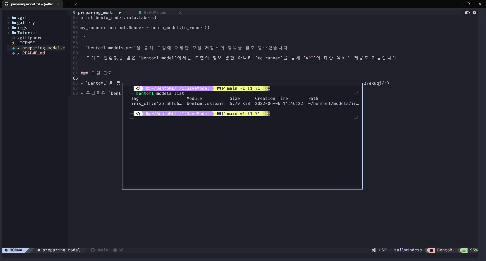
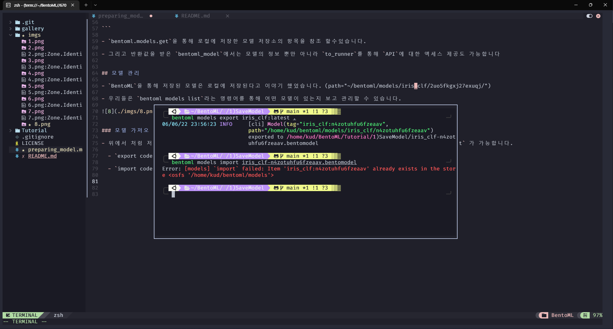
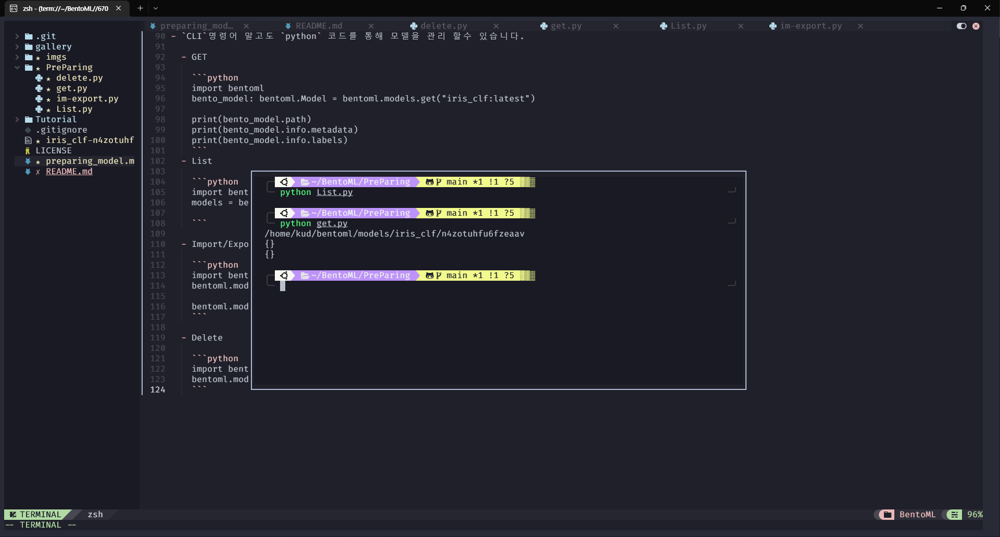
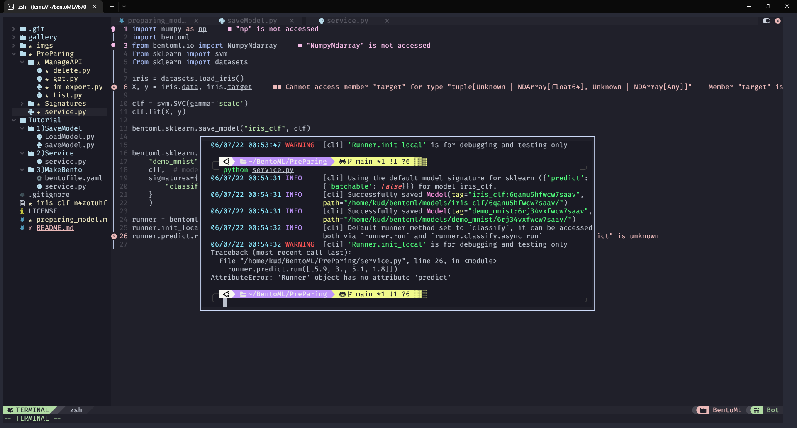

# 모델 준비

## 훈련된 모델 저장 

- `BentoML`을 사용하기 위해서는 훈련된 `ML`의 모델을 `BentoML API`로 저장해야 합니다.

- 대부분의 경우는 앞서 설명한것 처럼 콬드 한줄이면 저장이 됩니다.

  - ex) `bentoml.sklearn.save_model("iris_clf", clf)`

- 추가적으로는 `label`, `metadata`, `custom_objects` 3가지로 저장해볼수 있습니다.
  
  ```python
    bentoml.pytorch.save_model(
    "demo_mnist",   # 로컬 모델 저장소에 저장할 모델의 이름
    trained_model,  # model instance being saved
    labels={    # 모델의 관리를 위한 사용자 정의 레이블 예) team = nlp, stage = dev
        "owner": "nlp_team",
        "stage": "dev",
    },
    metadata={  # dataset version, training parameters, model scores 등 정보를 정의 
        "acc": acc,
        "cv_stats": cv_stats,
        "dataset_version": "20210820",
    },
    custom_objects={    # 사용자 정의 추가 파이썬 객체(전처리, 토크나이저)
        "tokenizer": tokenizer_object,
    }
  ```

## 저장된 모델 검색 

- 저장된 모델을 사용 위해서는 `load_model` 를 통해서 다시 로드할수 있습니다.

```python
import bentoml
from sklearn.base import BaseEstimator

model:BaseEstimator = bentoml.sklearn.load_model("iris_clf:latest")
```

- 모델에 대한 정보( 앞서 save_model에서 지정한 정보 )를 다시 보기 위해서는 `get`를 통해서 볼수 있습니다.

```python

import bentoml
bento_model: bentoml.Model = bentoml.models.get("iris_clf:latest")

print(bento_model.tag)
print(bento_model.path)
print(bento_model.custom_objects)
print(bento_model.info.metadata)
print(bento_model.info.labels)

my_runner: bentoml.Runner = bento_model.to_runner()

```

- `bentoml.models.get`을 통해 로컬에 저장한 모델 저장소의 항목을 참조 할수있습니다.

- 그리고 반환값을 받은 `bentoml_model`에서는 모델의 정보 뿐만 아니라 `to_runner`를 통해 `API`에 대한 엑세스 제공도 가능합니다   


## 모델 관리

- `BentoML`을 통해 저장된 모델은 로컬에 저장된다고 이야기 했었습니다. (path="~/bentoml/models/iris_clf/2uo5fkgxj27exuqj/")

- 우리들은 `bentoml models list`라는 명령어를 통해 어떤 모델이 있는지 보고 관리할 수 있습니다.

 


### 모델 가져오기 및 내보내기

- 위에서 처럼 저장한 모델을 팀원 간에 모델을 공유하거나 다른 빌드 단계에서 모델의 관리하기 위해 `export`, `import` 가 가능합니다. 

  - `export code` : bentoml models export <export할 모델 이름>

  - `import code` : bentoml models import <export된 이미지 이름>

 

- `export`는 정상 작동이 된거 같으나 `import`는 정상 작동이 되지 않을것입니다.

- 그 이유는 이미 해당 모델이 있기 때문에 `import`를 시킬 필요가 없기 때문입니다. 


### 모델 관리 API

- `CLI`명령어 말고도 `python` 코드를 통해 모델을 관리 할수 있습니다.

  - GET

    ```python
    import bentoml
    bento_model: bentoml.Model = bentoml.models.get("iris_clf:latest")
     
    print(bento_model.path)
    print(bento_model.info.metadata)
    print(bento_model.info.labels)
    ```
  - List 

    ```python
    import bentoml
    models = bentoml.models.list()
    
    ```

  - Import/Export

    ```python 
    import bentoml
    bentoml.models.export_model('iris_clf:latest', '/path/to/folder/my_model.bentomodel')

    bentoml.models.import_model('/path/to/folder/my_model.bentomodel')
    ```

  - Delete

    ```python
    import bentoml
    bentoml.models.delete("iris_clf:latest")
    ```
 


## 모델 러너  사용

- `bentoml.Service`에서 모델을 작동시키는 방법은 `to_runner`를 사용하는 방법입니다.   

- `Runner`는 모델의 처리 방법, 하드웨어 리소스 등 여러가지를 담당하고 있습니다.

- 튜토리얼에서 했던것 처럼 `to_runner`API를 통해 저장된 모델에서 모델 `Runner` 를 만들수 있습니다  

  - ex) `iris_clf_runner = bentoml.sklearn.get("iris_clf:latest").to_runner()`

- 이제 러너가 만들어 졌으니 `bentoml.Service`를 생성할수 있습니다.

  ```python
  svc = bentoml.Service("iris_classifier", runners=[iris_clf_runner])

  @svc.api(input=NumpyNdarray(), output=NumpyNdarray())
  def classify(input_series: np.ndarray) -> np.ndarray:
    result = iris_clf_runner.predict.run(input_series)
    return result
  ```

- 이 외에도 API 콜백 함수를 작성하기전 (@svc.api 전)에 `Runner`가 잘 작동하는지 테스트 하기 위해 로컬에서 인스턴스를 만들수 있습니다.

  ```python
  # Create a Runner instance:
  iris_clf_runner = bentoml.sklearn.get("iris_clf:latest").to_runner()

  # Initializes the runner in current process, this is meant for development and testing only:
  iris_clf_runner.init_local()

  # This should yield the same result as the loaded model:
  iris_clf_runner.predict.run([[5.9, 3., 5.1, 1.8]])
  
  ``` 

## 모델 서명(Model Signatures)

- 위의 예시를 보면 알지만 `iris_clf_runner.predict.run(input_series)`는 `input_series`라는 값을 통해 입력이 전달 됩니다.

- 하지만 다른 `FrameWork`에 따라 `predict`가 사용되지 않을수도 있습니다.

- 이런 경우에는 `save_model`에서 `signatures`를 통해서 커스터마이징 할수 있습니다  


```python
import numpy as np
import bentoml
from bentoml.io import NumpyNdarray
from sklearn import svm
from sklearn import datasets

iris = datasets.load_iris()
X, y = iris.data, iris.target

clf = svm.SVC(gamma='scale')
clf.fit(X, y)

bentoml.sklearn.save_model("iris_clf", clf)


bentoml.sklearn.save_model(
    "demo_mnist",  # model name in the local model store
    clf,  # model instance being saved
    signatures={   # model signatures for runner inference
        "predict": {"batchable": False,}
    }
    )

runner = bentoml.sklearn.get("demo_mnist:latest").to_runner()
runner.init_local()
runner.predict.run([[5.9, 3., 5.1, 1.8]])
```

- 예를 들어 우리가 이전부터 계속 사용하던 코드인 svc를 사용한다고 가정하겠습니다.LLICENSE

- 이 경우에 우리는 `classify` 보다는 `predict`를 사용하고 싶다면 위처럼 했을시 `classify`를 했을떄 에러가 발생하게 됩니다 

 

- 또한 재미있는 점은 `signatures`안에 `__call__`을 넣었을떄 입니다.

```language

import numpy as np
import bentoml
from bentoml.io import NumpyNdarray
from sklearn import svm
from sklearn import datasets

iris = datasets.load_iris()
X, y = iris.data, iris.target

clf = svm.SVC(gamma='scale')
clf.fit(X, y)

bentoml.sklearn.save_model("iris_clf", clf)


bentoml.sklearn.save_model(
    "demo_mnist",  # model name in the local model store
    clf,  # model instance being saved
    signatures={   # model signatures for runner inference
        "__call__": {"batchable": False,},
    }
    )

runner = bentoml.sklearn.get("demo_mnist:latest").to_runner()
runner.init_local()
runner.run([[5.9, 3., 5.1, 1.8]])

```

- 해당 코드는 에러가 발생합니다. (SVC 에서 __call__에 대한 내용이 없어서 ㅠㅠ )

- 하지만 존재할 경우 간단하게 run을통해 구동시킬수 있습니다.

## Batching

- 배치를 지원하는 모델의 경우 `signatures`에서 이를 간단하게 사용할수 있습니다.

- 예를 들어 예측을 실행할 두 개의 입력([1, 2] 및 [3, 4])이 있는 경우 예측 방법으로 전달할 배열이 [[1, 2]], [3, 4]이면 배치 차원은 0이 됩니다. 

- 예측 방법으로 전달할 배열이 [[1, 3], [2, 4]]인 경우 배치 치수는 1이 됩니다. 

```python
# Save two models with `predict` method that supports taking input batches on the
# dimension 0 and the other on dimension 1:
bentoml.pytorch.save_model("demo0", model_0, signatures={
    "predict": {"batchable": True, "batch_dim": 0}}
)
bentoml.pytorch.save_model("demo1", model_1, signatures={
    "predict": {"batchable": True, "batch_dim": 1}}
)

# if the following calls are batched, the input to the actual predict method on the
# model.predict method would be [[1, 2], [3, 4], [5, 6]]
runner0 = bentoml.pytorch.get("demo0:latest").to_runner()
runner0.init_local()
runner0.predict.run(np.array([[1, 2], [3, 4]]))
runner0.predict.run(np.array([[5, 6]]))

# if the following calls are batched, the input to the actual predict method on the
# model.predict would be [[1, 2, 5], [3, 4, 6]]
runner1 = bentoml.pytorch.get("demo1:latest").to_runner()
runner1.init_local()
runner1.predict.run(np.array([[1, 2], [3, 4]]))
runner1.predict.run(np.array([[5], [6]]))
```
