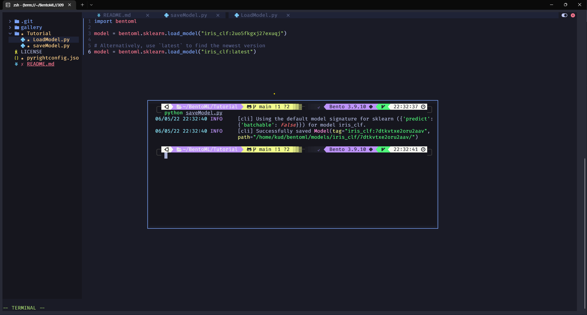
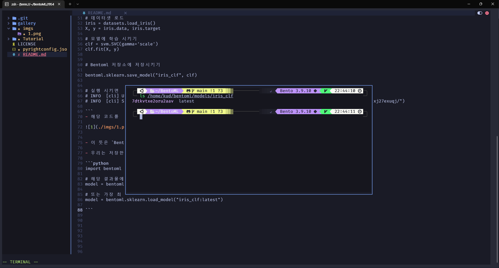
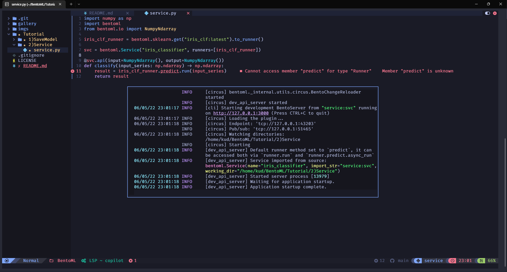
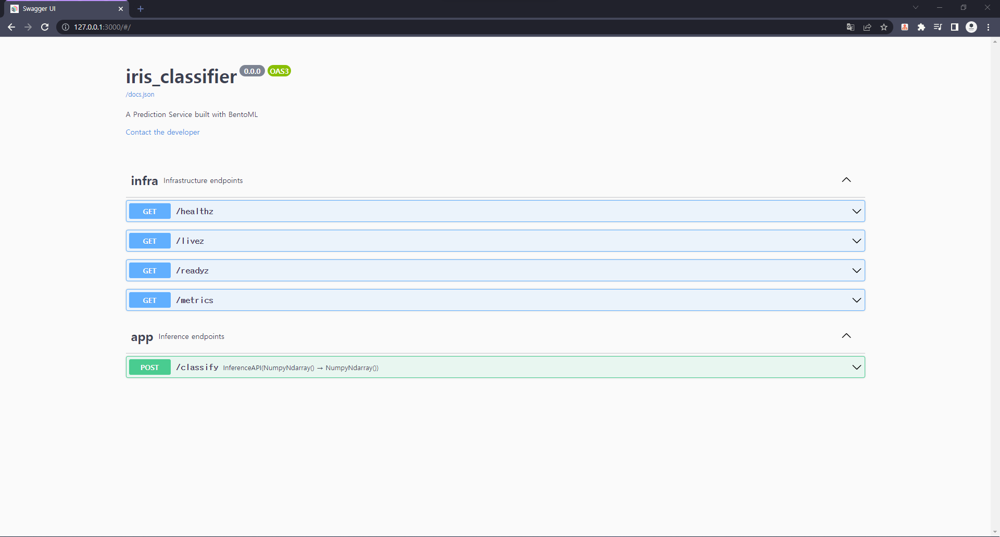
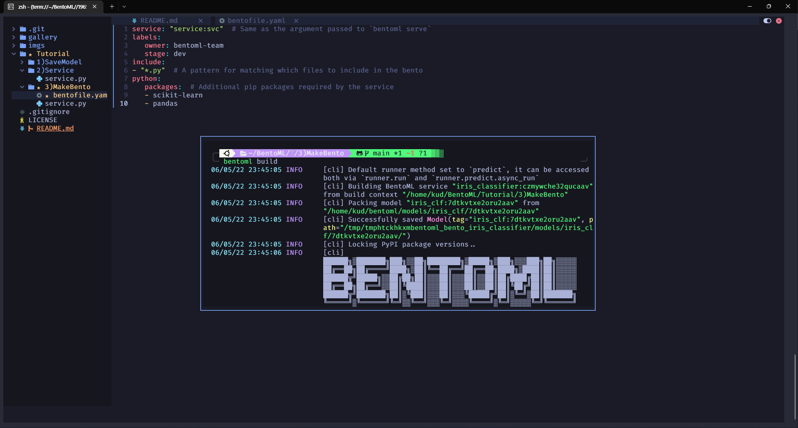
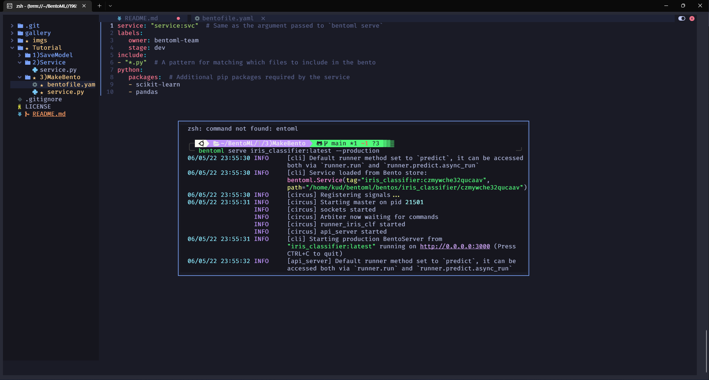
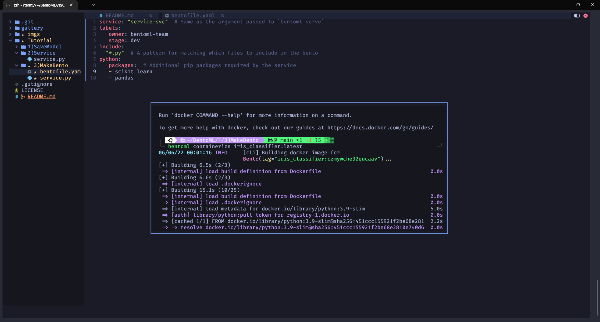

# BentoML 이란?

- 머신러닝과 딥러닝 모델을 만들고 `model`을 어떻게 `Serving`할 것인가는 큰 고민거리입니다.

- 단순히 `Model`의 결과를 `DB`에 저장하여 사용할 것인지?

- 아니면 `API`를 사용할 것인지?

- ML 개발자들은 `Model`을 만들면 해당 모델을 쉽게 배포, 테스트 등을 할수 있어야 합니다.

- `BentoML`은 이러한 고민들을 해결 하기 위해 만들어진 라이브러리 입니다.


## BentoML 튜토리얼 설정

- `BentoML` 튜토리얼 하기 위해서는 두가지 방법이 있습니다.

  - 하나는 `Colab`을 이용하는 방법

  - 나머지는 `Local`에서 이요하는 방법


- 저는 `Local`에서 이용되는 방법을 사용할것이고 해당 소스 코드는 [링크](https://github.com/bentoml/gallery/) 에서 확인이 가능합니다.

- 또한 로컬에서 작업을 하기 위해서는 `python 3.7`이상이 필요합니다.

- 그럼 `BentoML`에서 필요한 종속 라이브러리를 설치 해보도록 해보겠습니다.

- 필자는 `pyenv`를 통해 가상환경을 `3.9.10`  설정하고 진행해보았습니다.

```bash

pip install --pre bentoml

pip install scikit-learn pandas

```

### BentoML 모델 저장

- `BentoML`을 시작하려면 `BentoML`에서 제공하는 모델 저장소에 저장을 해야합니다.

- 간단한 예제 코드를 통해 한번 보도록 해보죠

```python
import bentoml # bentoml API load

from sklearn import svm # scikit learn에서 svm 가져오기 
from sklearn import datasets # iris 데이터를 가져오기 위해서 로드 

# 데이터셋 로드 
iris = datasets.load_iris()
X, y = iris.data, iris.target

# 모델에 학습 시키기 
clf = svm.SVC(gamma='scale')
clf.fit(X, y)


# Bentoml 저장소에 저장시키기

bentoml.sklearn.save_model("iris_clf", clf)


# 실행 시키면 아래 처럼 결과물이 나오게 될겁니다.
# INFO  [cli] Using default model signature `{"predict": {"batchable": False}}` for sklearn model
# INFO  [cli] Successfully saved Model(tag="iris_clf:2uo5fkgxj27exuqj", path="~/bentoml/models/iris_clf/2uo5fkgxj27exuqj/")

```
- 해당 코드를 실행 시키면 결과물이 아래처럼 나오게 될것입니다.

 

- 이 뜻은 `BentoML`에서 `Local`에 모델을 저장 했다는것입니다.

- 해당 디렉토리로 가면 폴더가 있는것을 볼수있습니다. 
 

- 우리는 저장한 모델을 불러올수 있게 되는데 아래 코드를 통해 불러올수 있습니다.

```python
import bentoml # bentoml API load

# 해당 결과물에서 나온 코드값으로 모델을 불러올수  있으며 
model = bentoml.sklearn.load_model("iris_clf:7dtkvtxe2oru2aav")

# 또는 가장 최근에 저장한 모델을 불러올수 있습니다.
model = bentoml.sklearn.load_model("iris_clf:latest")

```

- 해당 예시는 `scikit-learn`에서 저장하는 방법입니다.

- `FrameWork`별 차이가 있긴 하지만 `pytorch`의 경우에는 `bentoml.pytorch.save_model`, `tensorflow`의 경우는 `bentoml.tensorflow.save_model`과 같이 나타나게 됩니다. 자세한 사항은 [링크]("https://docs.bentoml.org/en/latest/frameworks/index.html") 

### 서비스 만들기 

- 서비스는 `BentoML`에 가장 핵심이 되는 요소입니다.

> 공식 문서에서는 `service`라고 적혀 있지만 사실 API 구축 정도로 이해하시면 편할듯 합니다. 

- 해당 내용을 보기위해 `service.py`를 통해 확인해보도록 하겠습니다. 

```python
# import Library
import numpy as np
import bentoml
from bentoml.io import NumpyNdarray

# Save Model 에서 진행한 Model을 로드해서 돌리기
iris_clf_runner = bentoml.sklearn.get("iris_clf:latest").to_runner()

# BentoML 서비스에 올리기 
svc = bentoml.Service("iris_classifier", runners=[iris_clf_runner])

# 해당 API를 사용하기 위해 input, ouput에 대한 annotation
@svc.api(input=NumpyNdarray(), output=NumpyNdarray())

# classify 함수 지정 
def classify(input_series: np.ndarray) -> np.ndarray:
    result = iris_clf_runner.predict.run(input_series)
    return result

```

- 해당 파일을 만들고 파일 위치로 가서 아래 명령어를 입력해주시면 서비스가 구축됩니다.

```bash
bentoml serve service:svc --reload


INFO [cli] Starting development BentoServer from "service:svc" running on http://127.0.0.1:3000 (Press CTRL+C to quit)
INFO [dev_api_server] Service imported from source: bentoml.Service(name="iris_classifier", import_str="service:svc", working_dir="/home/user/gallery/quickstart")
INFO [dev_api_server] Will watch for changes in these directories: ['/home/user/gallery/quickstart']
INFO [dev_api_server] Started server process [25915]
INFO [dev_api_server] Waiting for application startup.
INFO [dev_api_server] Application startup complete.
```
 

- service파이썬 모듈( service.py파일) 을 나타냅니다.

- svc에서 생성된 객체를 참조합니다 service.py.svc = bentoml.Service(...)

- --reload옵션은 로컬 코드 변경 사항을 감시하고 자동으로 서버를 다시 작동하게 합니다( Hotreload )

- `BentoML`은 기본적으로 `Swagger`를 지원하기 때문에 브라우저에서 요청을 주고받기 쉽게 되어있습니다.

- `http://127.0.0.1:3000/` 주소를 통해 `Swagger`페이지를 볼수 있습니다. [링크]('http://127.0.0.1:3000/')

 

- 이 외의 방법으로 `python` 코드를 통해, `Curl` 명령어를 통해 보낼수도 있습니다. 

- python

  ```python
  import requests
  requests.post(
      "http://127.0.0.1:3000/classify",
      headers={"content-type": "application/json"},
      data="[[5.9, 3, 5.1, 1.8]]").text
  ```
- Curl

  ```bash
    curl \
    -X POST \
    -H "content-type: application/json" \
    --data "[[5.9, 3, 5.1, 1.8]]" \
    http://127.0.0.1:3000/classify
  ```

### Bento 만들기 

- 서비스 정의가 완료 되면 모델과 서비스를 `Bento`로 만들수 있습니다. 

> 흠.... 저는 일본어 보다는 도시락이라고 표현하고 싶네요 ㅎㅎ

- `Bento`는 서비스를 실행하는데 필요한 코드,모델,종속성을 포함한것이라고 생각하면됩니다.

- 아래코드를 `bentofile.yaml`파일을 만든 다음 넣어주면 됩니다. 
```yaml
service: "service:svc"  # Same as the argument passed to `bentoml serve`
labels:
   owner: bentoml-team
   stage: dev
include:
- "*.py"  # A pattern for matching which files to include in the bento
python:
   packages:  # Additional pip packages required by the service
   - scikit-learn
   - pandas

```
> Kubernetes, Docker를 만져보신 분들이라면 익숙하실거라고 생각합니다.init

- 해당 코드는 `bentoml build`를 통해서 실행 시킬수 있습니다. 

 

- 만약 위의 결과물처럼 나온다면 여러분들은 `Bento`를 성공적으로 만들었습니다.

- 이제 `prdouction`을 진행할수 있는데 간단하게 돌려 해보도록 하겠습니다.

- 해당 명령어를 통해 ` bentoml serve iris_classifier:latest --production` 실행시켜보도록 하겠습니다.

 


### Docker Image 생성

- 위에서 만든 `Bento`를 명령어를 통해 간단하게 `Docker Image`로 만들수 있습니다.

- `bentoml containerize iris_classifier:latest` 를 통해 만들수 있으나 Docker가 반드시 설치 되어있어야합니다.

 


